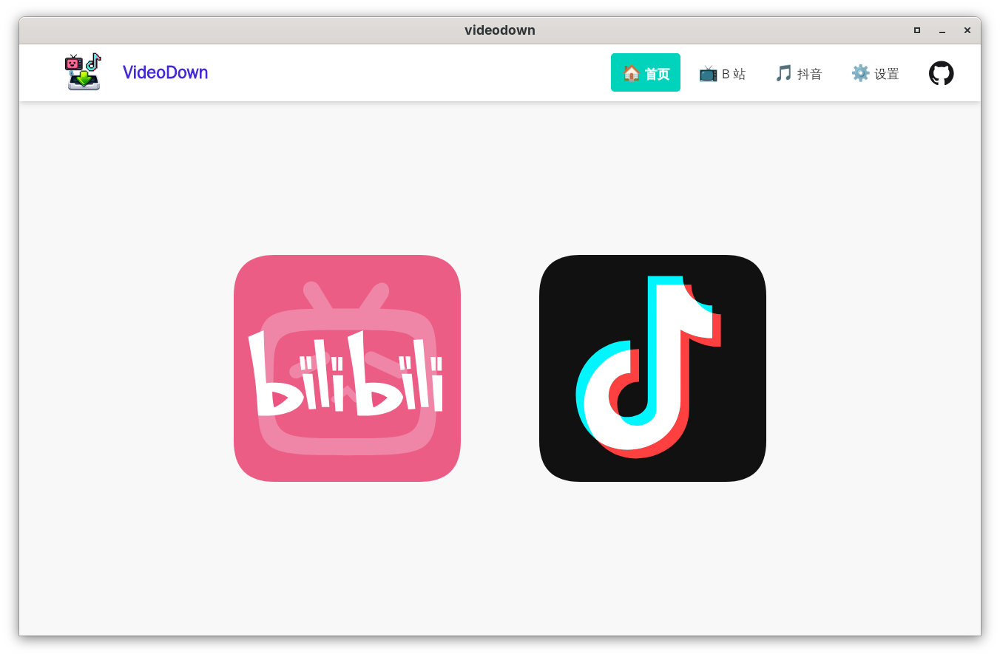
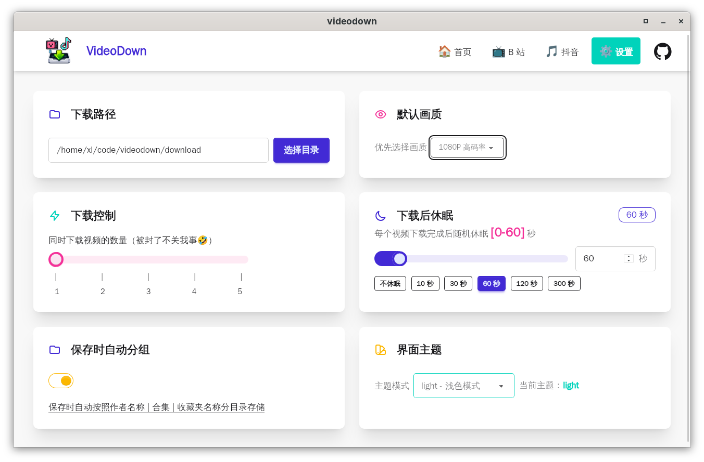
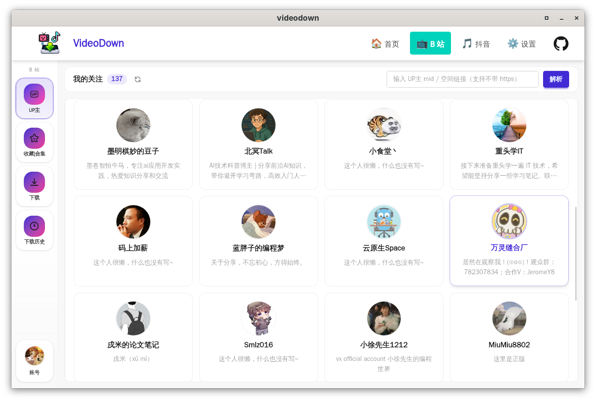
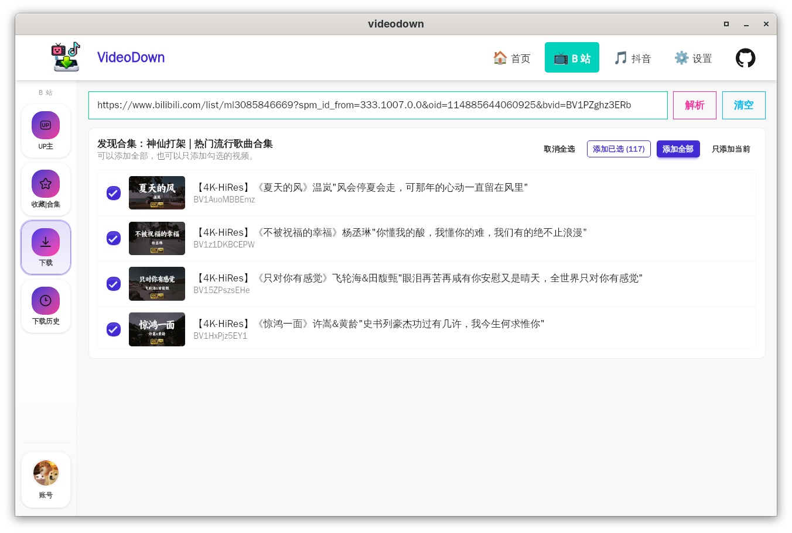
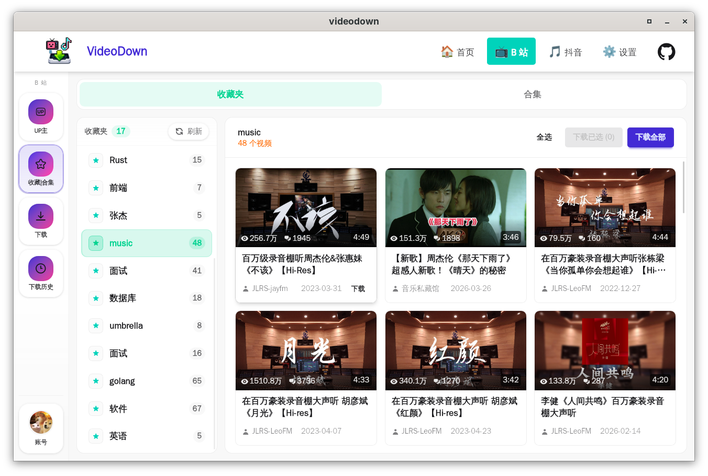
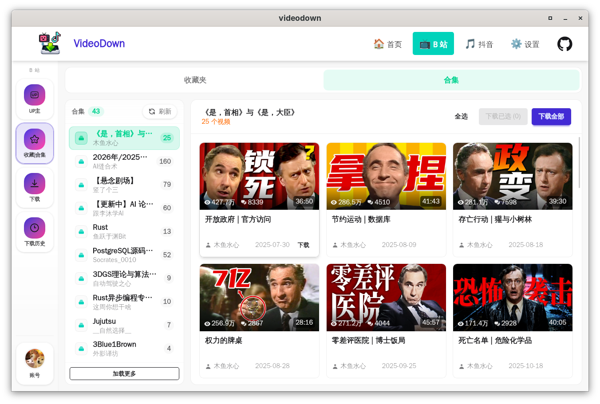
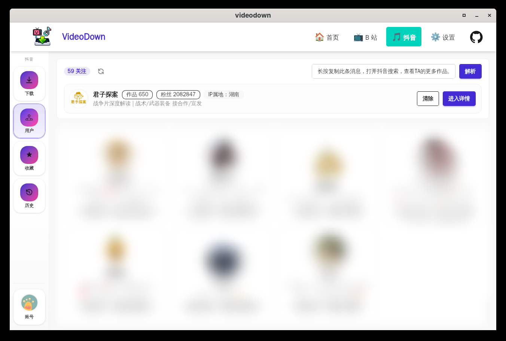
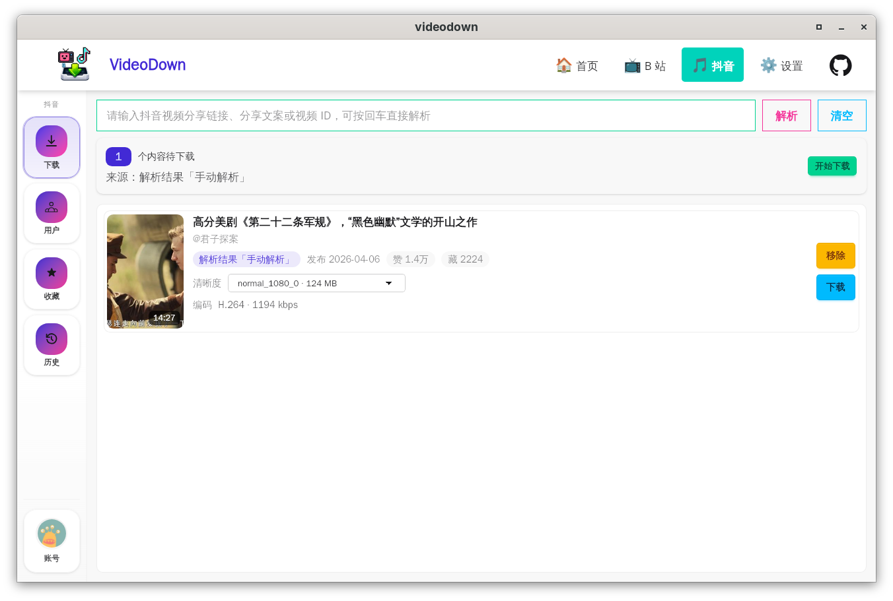
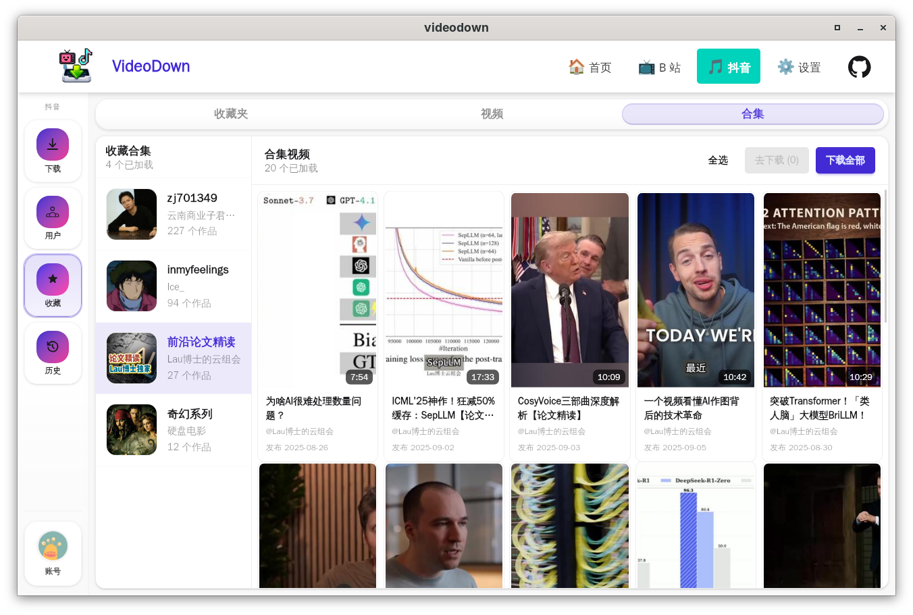
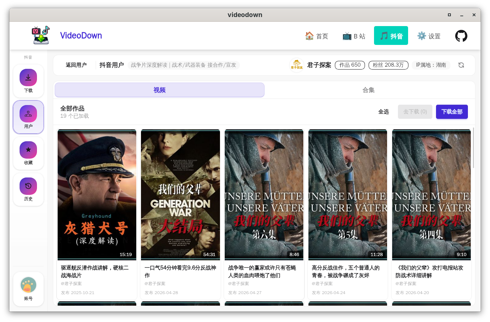

# VideoDown

VideoDown 是一个基于 [Wails](https://wails.io/zh-Hans/)、[Go](https://go.dev) 和 [SolidJS](https://www.solidjs.com/)
开发的桌面视频下载工具（初期使用Tauri+Rust，但是tmd占用磁盘太多了😅，一看40多个G），目前主要支持哔哩哔哩和抖音。

> 本项目仍可能受到平台接口变化影响。如果接口返回结构、鉴权参数或风控策略变化，部分功能可能需要同步调整。

## 项目初衷🤓

每逢月末流量不够😭无法观看助眠视频

大家自行使用😊，🫵**不要贩卖**😡

## 软件预览🥳

### 总览

| 首页                     | 设置                         |
|------------------------|----------------------------|
|  |  |

### 哔哩哔哩

| UP 主页面                              | 下载页                                              |
|-------------------------------------|--------------------------------------------------|
|             |           |
| 收藏夹                                 | 收藏夹合集                                            |
|  |  |

### 抖音

| 用户页                              | 下载页                                       |
|----------------------------------|-------------------------------------------|
|  |       |
| 收藏页                              | 用户作品页                                     |
|  |  |

## 功能特性🎉

### 平台支持

- [x] Windows
- [x] Linux
- [ ] MacOS(没有设备，无法测试，但是依赖 WebView，理论是可以的)

### 哔哩哔哩

- 二维码登录和账号状态展示
- 关注 UP 主列表
- UP 主稿件、合集、系列、分 P 浏览
- 视频链接或 BV 号解析
- 收藏夹和收藏夹内合集浏览
- 下载队列、清晰度/音轨选择、下载进度
- 批量下载收藏夹、合集、系列、UP 主视频
- 下载历史查看和删除

### 抖音

- Cookie 登录和账号信息展示
- 用户搜索、用户作品列表、用户合集
- 收藏视频、收藏合集浏览
- 分享链接、分享文案或视频 ID 解析
- 普通视频和图片合集识别
- 多清晰度选项展示
- 下载队列、批量下载、下载进度
- 下载来源区分：收藏视频、收藏合集、用户作品、用户合集、手动解析
- 下载历史查看和删除

### 未来计划🧐

- [ ] 细节优化
- [ ] 代码优化（前端半吊子，所以大量借助AI生成）
- [ ] 哔哩哔哩检测登录状态是否过期
- [ ] 哔哩哔哩大会员更高质量视频下载测试（没钱充会员🥹）
- [ ] 抖音图文下载
- [ ] `ffmpeg`不存在时自动下载
- [ ] 自动更新

## 技术栈

- 桌面框架：Wails v2
- 后端：Go、BadgerDB、req/v3
- 前端：SolidJS、TanStack Router、Tailwind CSS、DaisyUI

## 开发

### 环境要求

- Go 1.26+
- Node.js 和 npm
- Wails CLI
- ffmpeg

哔哩哔哩下载通常需要合并视频流和音频流，因此必须安装 `ffmpeg` 并确保命令行可以直接访问：

```bash
ffmpeg -version
```

如果系统无法识别 `ffmpeg`，请先安装并配置环境变量。

### 运行

安装前端依赖：

```bash
cd frontend
npm install
```

返回项目根目录后启动 Wails 开发模式：

```bash
wails dev
```

前端单独构建：

```bash
cd frontend
npm run build
```

生成 Wails 前端绑定：

```bash
wails generate module
```

运行后端测试：

### 构建

在项目根目录执行：

```bash
wails build
```

构建产物会输出到 Wails 默认的 build 目录中。不同平台的打包依赖请参考 Wails 官方文档。

## 使用说明

### 基础设置

1. 打开“设置”页面，选择下载目录。
2. 根据需要设置下载后休眠时间、并发数量和保存时是否自动分组。
3. 确认 `ffmpeg` 已安装，尤其是下载 B 站 DASH 视频时。

### 哔哩哔哩

1. 进入 B 站账号页，使用二维码登录。
2. 可以从关注 UP 主、收藏夹、合集、系列或下载页手动解析视频。
3. 将视频加入下载队列后，在下载页选择画质和音轨。
4. 点击单个下载或批量下载。

### 抖音

1. 进入抖音账号页，粘贴浏览器中的完整 Cookie。
2. Cookie 建议至少包含 `sessionid`、`ttwid`、`UIFID`、`s_v_web_id`。
3. 可以从收藏、用户页、合集页加入下载队列，也可以在下载页粘贴分享链接手动解析。
4. 如果视频是图片合集，下载时会保存为一个目录，图片按序号落盘。
5. 如果接口返回多个视频清晰度，可以在下载卡片中选择对应选项。

## 数据和文件

> 本项目绝对不会私自收集、上传用户信息

- 本地配置、Cookie、下载历史等数据存储在本地的 BadgerDB 中。
- 下载文件默认保存到设置页指定的目录。
- 启用自动分组后，后端会按来源类型创建目录，例如收藏合集、用户合集、收藏视频或用户作品。

## 注意事项

- 平台接口和风控策略可能随时变化，Cookie、二维码登录或解析接口可能失效。
- 抖音接口返回字段非常庞大，当前模型只保留了项目使用到的关键字段。如需二次开发，可以参考 `douyin/model` 和 `douyin/api`。
- B 站相关模型保留字段较多，方便后续扩展。
- 请不要将账号 Cookie 分享给他人，也不要提交到公开仓库。

## 贡献指南

- 欢迎提交 Pull Request 或 Issue 讨论功能需求、bug 修复或代码优化。
- 邮箱联系我：kamiertop@gmail.com

## 免责声明⚠️

本项目仅用于个人学习、研究和技术交流。请遵守相关平台服务条款、版权法律法规和内容所有者授权要求。使用本项目产生的任何风险和后果由使用者自行承担。

请勿将本项目用于商业用途、批量抓取、侵犯版权、绕过平台限制或其他违法违规行为。

## License

许可证暂未最终确定。

如果你计划复制、修改、分发或二次开发本项目，请先确认仓库中的最终许可证文件和第三方依赖许可证。当前阶段不建议在未确认许可证的情况下进行商业使用或再分发。

## 致谢🤗

- 视频流说明：[bilibili-API-collect](https://sessionhu.github.io/bilibili-API-collect/)
- aBogus，提示不要使用二维码登录，用Cookie（我听劝）：[TikTokDownloader](https://github.com/JoeanAmier/TikTokDownloader)
- 提示使用Cookie：[Douyin_TikTok_Download_API](https://github.com/Evil0ctal/Douyin_TikTok_Download_API)
- Codex 和 ChatGPT 在代码生成和优化方面提供了巨大帮助。
